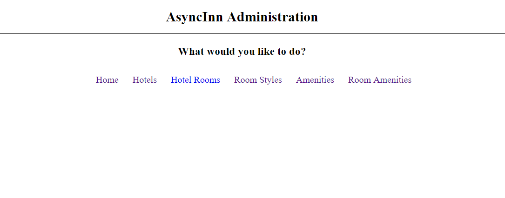

# Async Inn
A web page that simulates the admin function for managing a hotel. This uses .NET Core and Entity Framework. 

## Database Schema

## Database Relations
- Room - Room layout type as an enum (studio, oneBed, twoBed). One to many relationship with Hotel Room

- Hotel - Properties name, address, and phone. One to many relationship to HotelRoom.

- HotelRoom - Composite key with a primary and a foreign key. Has properties rate and pet friendliness. Many to one relationship to Room and Hotel.

- Amenities - Name property of a specific amenity. One to many relationship with RoomAmenities.

- RoomAmenities - Pure join table of keys only, and represents a many to many relationship between two tables. Many to one relationship with Amenities and Room.

## To Run:
* git clone git@github.com:carloscadena/AsyncInn.git
* cd AsyncInn
* Open the sln file with Visual Studio
* Run the application with IIS Express

## Visual
